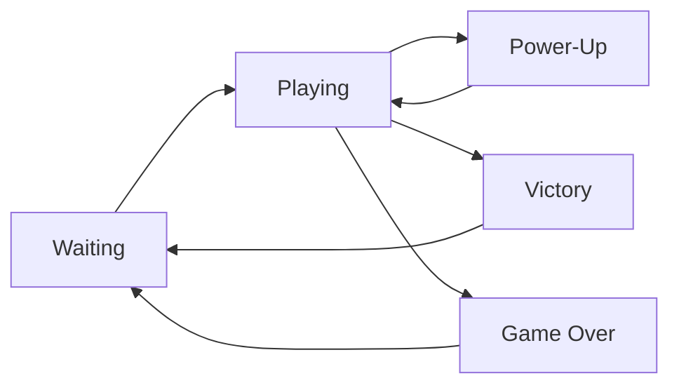

# 🎮 PacBlox - A Pac-Man Style Game for Roblox

<div align="center">
  
  
  
  
  
  
  
</div>

## 📖 Table of Contents
- [Overview](#-overview)
- [Features](#-features)
- [Installation](#-installation)
- [Game Mechanics](#-game-mechanics)
- [Project Structure](#-project-structure)
- [Customization Guide](#-customization-guide)
- [Controls](#-controls)
- [Development](#-development)
- [Publishing](#-publishing)
- [Contributing](#-contributing)
- [Credits](#-credits)

## 🎯 Overview

PacBlox is a complete recreation of the classic Pac-Man arcade game built specifically for the Roblox platform. This educational project demonstrates advanced game development concepts including AI pathfinding, state management, client-server architecture, and responsive UI design.

### Why PacBlox?
- **Fully Playable**: Complete game with all core Pac-Man mechanics
- **Educational**: Well-documented code perfect for learning Roblox development
- **Customizable**: Easy to modify mazes, speeds, and game rules
- **Multiplayer Ready**: Supports multiple players with proper networking
- **Mobile Friendly**: Full touch control support for phones and tablets

## ✨ Features

### Core Gameplay
- 🏃 **Player Movement**: Smooth, responsive controls with collision detection
- 🍕 **Pellet Collection**: Strategic pellet placement throughout the maze
- 💪 **Power-Ups**: Turn the tables on ghosts with power pellets
- 👻 **Ghost AI**: Four unique ghost personalities with different behaviors
- 🏆 **Scoring System**: Track points with combo multipliers
- 🎯 **Win/Lose Conditions**: Classic arcade-style game progression

### Technical Features
- **Server-Authoritative**: Cheat-resistant architecture with server validation
- **Responsive UI**: Dynamic HUD that adapts to different screen sizes
- **Mobile Support**: Touch controls automatically enabled on mobile devices
- **Sound System**: Complete audio framework (ready for sound assets)
- **State Management**: Robust game state handling with smooth transitions
- **Modular Design**: Clean separation of concerns for easy maintenance

### Ghost Personalities
Each ghost has unique AI behavior patterns:

| Ghost | Color | Personality | Behavior |
|-------|-------|------------|----------|
| **Blinky** | Red | Shadow | Direct pursuit of player |
| **Pinky** | Pink | Speedy | Ambushes player from ahead |
| **Inky** | Cyan | Bashful | Unpredictable movements |
| **Clyde** | Orange | Pokey | Shy - flees when too close |

## 🚀 Installation

### Quick Start (Recommended)
1. **Download the repository**
   ```bash
   git clone https://github.com/yourusername/pacblox.git
   ```

2. **Open Roblox Studio**
   - Create a new Baseplate game
   - Delete the default SpawnLocation

3. **Import Scripts**
   - Follow the structure in `setup_instructions.md`
   - Copy each script to its designated location

### Detailed Setup

#### Server Scripts (ServerScriptService)
```
ServerScriptService/
├── MainServer (Script)
├── GameManager (ModuleScript)
├── MazeGenerator (ModuleScript)
├── PlayerController (ModuleScript)
├── GhostAI (ModuleScript)
├── PelletManager (ModuleScript)
└── SoundManager (ModuleScript)
```

#### Client Scripts (StarterPlayer/StarterPlayerScripts)
```
StarterPlayerScripts/
├── MainClient (LocalScript)
├── InputHandler (ModuleScript)
└── UIManager (ModuleScript)
```

## 🎮 Game Mechanics

### Movement System
- **Grid-Based Navigation**: Player moves along maze pathways
- **Collision Detection**: Prevents walking through walls
- **Direction Queueing**: Input buffering for smooth cornering
- **Speed Management**: Different speeds for player, ghosts, and power-up states

### Scoring System
| Action | Points | Description |
|--------|--------|-------------|
| Regular Pellet | 10 | Standard pellet collection |
| Power Pellet | 50 | Activates power-up mode |
| Ghost Eaten | 200 | During power-up only |
| Level Complete | 1000 | Bonus for clearing maze |

### Game States


### Ghost AI States
- **Scatter Mode**: Ghosts patrol their designated corners
- **Chase Mode**: Active pursuit of the player
- **Frightened Mode**: Fleeing from powered-up player
- **Eaten Mode**: Returning to ghost house after being eaten

## 📁 Project Structure

```
pacblox/
├── 📄 README.md                    # This file
├── 📄 setup_instructions.md        # Detailed setup guide
├── 📄 .gitignore                   # Git ignore rules
├── 📁 src/
│   ├── 📁 server/                  # Server-side scripts
│   │   ├── MainServer.lua          # Entry point and initialization
│   │   ├── GameManager.lua         # Core game loop and state
│   │   ├── MazeGenerator.lua       # Procedural maze generation
│   │   ├── PlayerController.lua    # Player physics and movement
│   │   ├── GhostAI.lua            # Ghost behavior and pathfinding
│   │   ├── PelletManager.lua      # Pellet spawning and collection
│   │   └── SoundManager.lua       # Audio system management
│   └── 📁 client/                  # Client-side scripts
│       ├── MainClient.lua         # Client initialization
│       ├── InputHandler.lua       # Input processing
│       └── UIManager.lua          # User interface rendering
└── 📁 assets/                      # Game assets (sounds, images)
```

## 🛠 Customization Guide

### Modifying the Maze

Edit `src/server/MazeGenerator.lua`:

```lua
-- Custom maze layout (smaller example)
MazeGenerator.MAZE_LAYOUT = {
    {1,1,1,1,1,1,1,1,1},  -- 1 = Wall
    {1,3,2,2,2,2,2,3,1},  -- 2 = Pellet
    {1,2,1,1,2,1,1,2,1},  -- 3 = Power Pellet
    {1,2,2,2,2,2,2,2,1},  -- 0 = Empty
    {1,1,1,1,1,1,1,1,1}
}
```

### Adjusting Game Parameters

#### Player Settings (`PlayerController.lua`)
```lua
PlayerController.MOVE_SPEED = 16        -- Studs per second
PlayerController.TURN_SPEED = 0.1       -- Turn smoothing
```

#### Ghost Settings (`GhostAI.lua`)
```lua
GhostAI.GHOST_SPEED = 14               -- Normal speed
GhostAI.FRIGHTENED_SPEED = 8           -- Fleeing speed
GhostAI.SCATTER_DURATION = 7           -- Seconds
GhostAI.CHASE_DURATION = 20            -- Seconds
```

#### Power-Up Settings (`PelletManager.lua`)
```lua
PelletManager.POWER_UP_DURATION = 10   -- Seconds
PelletManager.PELLET_SCORE = 10        -- Points
PelletManager.POWER_PELLET_SCORE = 50  -- Points
```

### Adding Sound Effects

1. Find or upload sounds to Roblox
2. Get the asset IDs (format: `rbxassetid://XXXXXXXXX`)
3. Update `SoundManager.lua`:

```lua
-- Replace placeholder with actual ID
pelletSound.SoundId = "rbxassetid://1234567890"
```

### Creating New Ghost Behaviors

Add custom personality in `GhostAI.lua`:

```lua
local GhostPersonality = {
    RED = "Blinky",
    PINK = "Pinky",
    BLUE = "Inky",
    ORANGE = "Clyde",
    CUSTOM = "YourGhost"  -- Add your ghost
}

-- Implement behavior in getChaseTarget()
elseif ghostData.personality == GhostPersonality.CUSTOM then
    -- Your custom AI logic here
    return customTargetPosition
```

## 🕹 Controls

### Desktop Controls
| Key | Action |
|-----|--------|
| **W** / **↑** | Move Up |
| **A** / **←** | Move Left |
| **S** / **↓** | Move Down |
| **D** / **→** | Move Right |

### Mobile Controls
- **Touch Buttons**: On-screen directional pad
- **Auto-Enable**: Detected and enabled automatically

## 💻 Development

### Prerequisites
- Roblox Studio (latest version)
- Basic understanding of Lua
- Git (for version control)

### Development Workflow

1. **Clone Repository**
   ```bash
   git clone https://github.com/yourusername/pacblox.git
   cd pacblox
   ```

2. **Make Changes**
   - Edit scripts in your preferred editor
   - Test in Roblox Studio

3. **Test Your Changes**
   - Use Studio's Play Solo mode
   - Test with multiple players using Start Server

4. **Commit Changes**
   ```bash
   git add .
   git commit -m "Description of changes"
   git push
   ```

### Testing Checklist
- [ ] Player spawns correctly
- [ ] Movement controls work (all directions)
- [ ] Pellets can be collected
- [ ] Score updates properly
- [ ] Ghosts chase player
- [ ] Power-ups activate correctly
- [ ] Ghosts flee during power-up
- [ ] Game over triggers on collision
- [ ] Victory triggers when all pellets collected
- [ ] UI displays correctly
- [ ] Mobile controls work (if applicable)

## 📤 Publishing

### Pre-Publication Steps

1. **Configure Game Settings**
   - Max Players: 1-4
   - Genre: Action/Classic
   - Devices: All platforms

2. **Add Polish**
   - Upload thumbnail image
   - Write engaging description
   - Add tags for discoverability

3. **Test Thoroughly**
   - Single player mode
   - Multiplayer functionality
   - Different devices

### Publication Process

1. In Roblox Studio: `File → Publish to Roblox`
2. Configure game settings
3. Set to Public when ready
4. Share link with alpha testers

### Monetization Options
- Game Passes (extra lives, speed boosts)
- Developer Products (continue after game over)
- Premium Benefits (exclusive mazes)

## 🤝 Contributing

We welcome contributions! Here's how to help:

### Contribution Guidelines

1. **Fork the Repository**
2. **Create Feature Branch**
   ```bash
   git checkout -b feature/your-feature
   ```
3. **Make Changes**
   - Follow existing code style
   - Comment your code
   - Test thoroughly
4. **Submit Pull Request**
   - Describe changes clearly
   - Reference any issues

### Areas for Contribution
- 🎨 **Visual Effects**: Particle systems, animations
- 🔊 **Sound Design**: Original sound effects and music
- 🗺 **Level Design**: New maze layouts
- 🤖 **AI Improvements**: Smarter ghost behaviors
- 📱 **Mobile UX**: Better touch controls
- 🌍 **Localization**: Multiple language support
- 🐛 **Bug Fixes**: Report and fix issues

### Code Style Guidelines
- Use descriptive variable names
- Comment complex logic
- Follow Lua naming conventions
- Keep functions focused and small
- Test edge cases

## 📈 Roadmap

### Version 1.0 (Current)
- ✅ Core gameplay
- ✅ Basic AI
- ✅ Scoring system
- ✅ Mobile support

### Version 2.0 (Planned)
- [ ] Multiple levels
- [ ] Difficulty progression
- [ ] Leaderboards
- [ ] Achievements
- [ ] Custom maze editor

### Version 3.0 (Future)
- [ ] Multiplayer versus mode
- [ ] Power-up variety
- [ ] Boss ghosts
- [ ] Seasonal themes
- [ ] Tournament mode

## 🐛 Known Issues

- Sound IDs are placeholders (no actual audio)
- Ghost pathfinding uses simplified algorithm
- No persistent high scores
- Single maze layout only

## 📚 Resources

### Roblox Development
- [Roblox Developer Hub](https://developer.roblox.com)
- [Lua Learning Resources](https://www.lua.org/manual/5.1/)
- [Roblox API Reference](https://developer.roblox.com/en-us/api-reference)

### Game Design
- [Pac-Man Dossier](https://www.gamasutra.com/view/feature/3938/the_pacman_dossier.php)
- [Ghost AI Behaviors](https://gameinternals.com/understanding-pac-man-ghost-behavior)

## 📜 License

This is an educational project created as a tribute to the classic Pac-Man game. 

**Important Legal Notice:**
- Pac-Man is a trademark of Bandai Namco Entertainment
- This project is for educational purposes only
- Not affiliated with or endorsed by Bandai Namco
- Please respect intellectual property rights

## 👏 Credits

### Development Team
- **Lead Developer**: Evyatar Bluzer
- **Game Design**: Classic arcade inspiration
- **Documentation**: Comprehensive guides included

### Special Thanks
- The Roblox developer community
- Classic arcade game designers
- Open source contributors

### Technologies Used
- **Platform**: Roblox Studio
- **Language**: Lua 5.1
- **Architecture**: Client-Server Model
- **Version Control**: Git

---

<div align="center">
  
  **Ready to Play?** 🎮
  
  [Download Scripts](https://github.com/yourusername/pacblox) | [Report Issues](https://github.com/yourusername/pacblox/issues) | [Contribute](https://github.com/yourusername/pacblox/pulls)
  
  Made with ❤️ for the Roblox community
  
</div>
